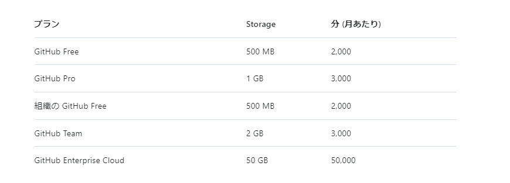

# monorepo-AWS-deploy-system
## どのようなリポジトリか
異なるプロジェクト(フォルダ)を一つのリポジトリで管理する
<br>(モノレポ / モノリポ)

## 使い方
### 初期設定
github 環境変数を設定する <br>
Settings -> Secrets and variables -> Actions -> Repository secrets 
```
AWS_ACCOUNT_ID
AWS_ACCESS_KEY_ID
AWS_SECRET_ACCESS_KEY
AWS_REGION
```
をそれぞれ設定する

### projectのブランチ切る
```bash
git switch -c <ブランチ名>
```

### 開発したい新しいフォルダを作成
```bash
mkdir <作成したフォルダ名>
```

### フォルダ構成を以下のようにする
```
.
└─ <新しいフォルダ>
      ├── Dockerfile 
      ├── src                         ・・・ 実際にlambdaコンテナに入れるフォルダ
      │    ├── lambda_function.py
      │    ├── service-account.json
      │    └── etc..
      └── requirements.txt            ・・・ 使いたいライブラリとそのバージョン
```


### Workflowを走らせて AWS resouseを新たに作成、 または 更新したい

workflowを実行したい場合に `<>` の中に 作成 または 更新したい フォルダ名を入れて コミットする<br>
具体的にはpull requestsの titleに含まれる <>内の名前を取得してる
```bash
git commit -m "<sample-project> 〇〇を変更"
```

### mainブランチに pull-requestsを出して承認してもらったら workflowが実行される
この際 `<>` の指定が無かったり、一致するフォルダ名がない場合はエラーとなる

## github actions の上限

